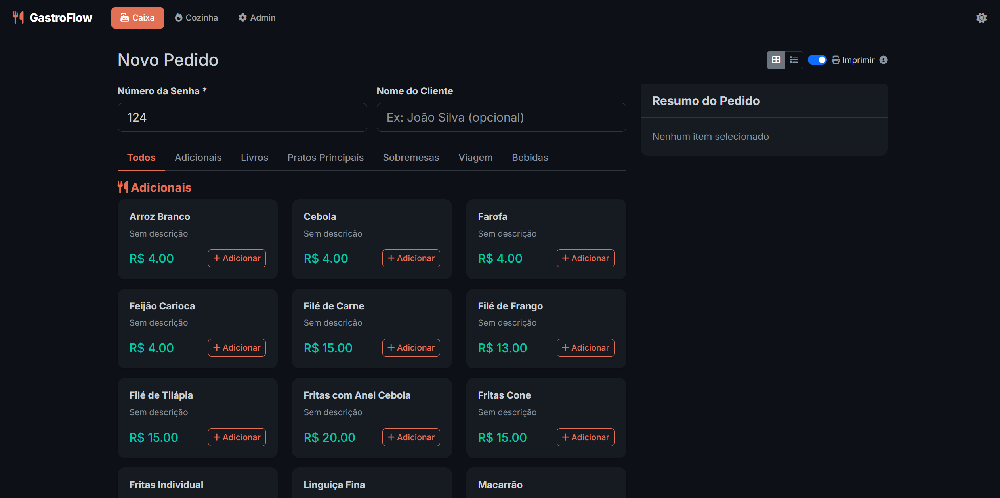
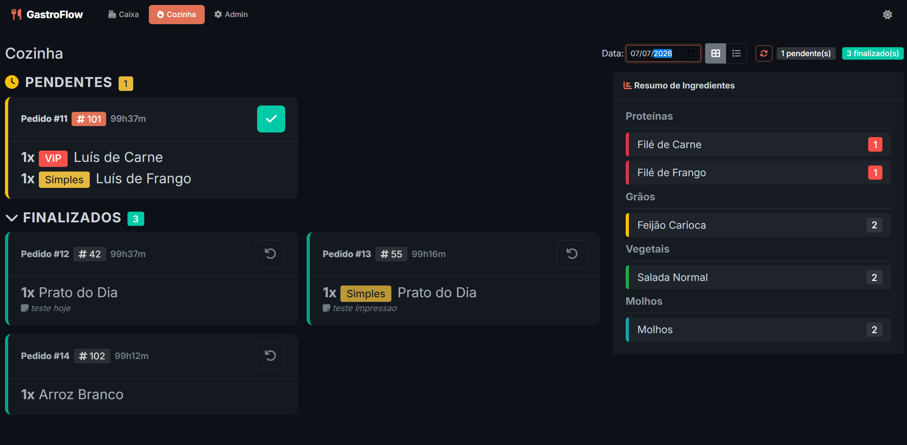
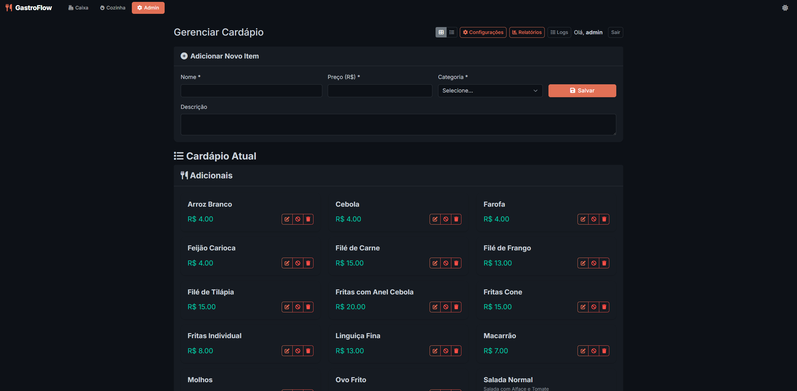
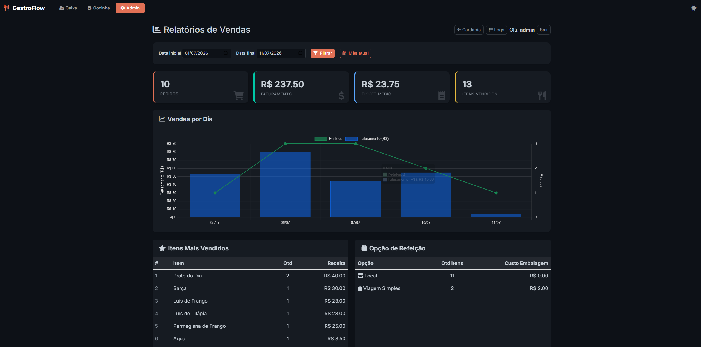
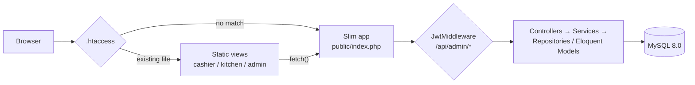
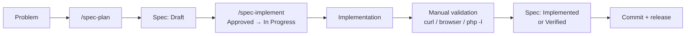

<p align="center">
  
</p>

<h1 align="center">GastroFlow</h1>

<p align="center">
  Restaurant order management system — cashier, kitchen, admin and reporting in one app.<br>
  PHP 8 (Slim 4 + Eloquent), Alpine.js, MySQL, Docker.
</p>

<p align="center">
  
  
  
  <a href="https://github.com/FocusEvenGitHub/GastroFlow/actions/workflows/ci.yml"></a>
</p>

---

## Contents

- [Screenshots](#screenshots)
- [Overview](#overview)
- [Documentation](#documentation)
- [Architecture](#architecture)
- [Engineering process](#engineering-process)
- [AI-assisted development](#ai-assisted-development)
- [Tech stack](#tech-stack)
- [Technical decisions](#technical-decisions)
- [Roadmap](#roadmap)
- [Learnings](#learnings)
- [Project philosophy](#project-philosophy)
- [Getting started](#getting-started)
- [Using the app](#using-the-app)
- [API](#api)
- [Commit convention & releases](#commit-convention--releases)
- [Contributing](#contributing)
- [Author](#author)

---

## Screenshots

<div align="center">
  <table>
    <tr>
      <td align="center" width="50%">
        
        <br><sub><b>Cashier</b> — place orders, select items, add notes, send to kitchen</sub>
      </td>
      <td align="center" width="50%">
        
        <br><sub><b>Kitchen</b> — real-time view of pending orders, mark as done</sub>
      </td>
    </tr>
    <tr>
      <td align="center" width="50%">
        
        <br><sub><b>Admin</b> — menu management (add, edit, enable/disable items)</sub>
      </td>
      <td align="center" width="50%">
        
        <br><sub><b>Reports</b> — sales dashboard and analytics</sub>
      </td>
    </tr>
  </table>
</div>

---

## Overview

GastroFlow is a restaurant order-management system: a cashier takes an order by table number, the kitchen sees it appear in real time and marks it done, an admin panel manages the menu and produces a receipt on a thermal printer, and a reporting module turns the accumulated order history into sales, timing and demand insights. It targets a single-location restaurant running everything — cashier terminal, kitchen display, admin panel — on one local network, which is why the design favors a simple, self-hosted deployment over a distributed one.

It continues to be developed both because the product itself has open functional ground (see [Roadmap](#roadmap)) and because it doubles as a working environment for practicing software engineering process — see [Project philosophy](#project-philosophy).

---

## Documentation

This README is the entry point. Depth lives alongside it, by topic:

| Doc | Covers |
|---|---|
| [`docs/architecture.md`](docs/architecture.md) | Full request lifecycle, layer-by-layer breakdown, SSE, jobs/printing, current limitations |
| [`docs/technical-decisions.md`](docs/technical-decisions.md) | Every decision below, with full trade-offs, plus open/unresolved ones |
| [`specs/`](specs/) | One file per change: problem, plan, implementation log, validation evidence |
| [`CLAUDE.md`](CLAUDE.md) | Rules that govern AI-assisted development in this repo |
| [`ROADMAP.md`](docs/ROADMAP.md) / [`CHANGELOG.md`](CHANGELOG.md) | What's planned next / what has already shipped |

---

## Architecture

Slim bootstraps in `public/index.php` → `App\App::get()` → `App\Routes::register()`. The detail that matters most: **not everything goes through Slim**. `public/.htaccess` serves any existing file or directory directly, so the cashier, kitchen and admin panels are plain Alpine.js views executed directly by Apache — only `/api/*` is an actual Slim route.



- `src/` follows Controllers → Services → Repositories/Models, but coverage is uneven by design-so-far: `Repositories/` exists for Menu and Order, not yet for Ingredient; `Validators/` covers only order input. This is the real current state, not smoothed over — full breakdown in [`docs/architecture.md`](docs/architecture.md).
- Kitchen live updates run over Server-Sent Events backed by a signal file, not a queue — fine for one instance, a known limit past that.
- Printing (ESC/POS) and order creation both go through an async DB-backed job queue (`bin/worker`), so a print failure never fails the order.

Full request lifecycle, the annotated project-structure tree, and the current list of architectural limitations: [`docs/architecture.md`](docs/architecture.md).

---

## Engineering process

- **Specs before non-trivial code.** Features, fixes and improvements go through a spec file under [`specs/`](specs/) — problem, proposed behavior, acceptance criteria, then an implementation log and validation evidence as work happens. `specs/000-project-baseline.md` is a code-verified snapshot of the whole system, written before any feature spec.
- **A defined lifecycle**, not just a folder of markdown: `Draft → Approved → In Progress → Implemented → Verified` (or `Cancelled`), per [`specs/README.md`](specs/README.md). `Verified` requires recorded evidence tied to acceptance criteria — it isn't granted on trust.
- **Persistent, written project rules.** [`CLAUDE.md`](CLAUDE.md) documents the confirmed stack, the actual code layering, the commands that really exist, and explicit security rules — a checked-in artifact, not tribal knowledge.
- **Conventional commit history and tagged releases.** Every commit follows a documented type/scope/emoji convention ([`COMMIT_CONVENTION.md`](docs/COMMIT_CONVENTION.md)); each release gets an annotated Git tag (`v1.0.0` … `v1.5.5`) and a [`CHANGELOG.md`](CHANGELOG.md) entry.



GitHub Actions now runs `composer install` + `vendor/bin/phpunit` on every push to `master` and every pull request (`.github/workflows/ci.yml`, added alongside `specs/004-phpunit-smoke-tests.md`/`specs/005-github-actions-ci.md`). No formal multi-person review sits in this flow yet — a single-maintainer project, currently. `Verified` status and its evidence requirement are what stand in for that.

---

## AI-assisted development

Claude Code participates in investigation, planning, implementation, refactoring, documentation, review and validation across this project — this README included. The model is:

**Human direction → AI execution → human validation.**

Two artifacts make that concrete rather than a claim:

- **[`CLAUDE.md`](CLAUDE.md)** — persistent rules read every session: the confirmed stack and architecture, the commands that actually exist, and hard boundaries (never touch `.env`/secrets, never commit without being asked, no destructive DB operations, no new dependencies unless asked, never claim a test passed without running it).
- **The `specs/` workflow, run by two checked-in skills** — [`.claude/skills/spec-plan`](.claude/skills/spec-plan/SKILL.md) investigates the real codebase and drafts a spec without touching any code; [`.claude/skills/spec-implement`](.claude/skills/spec-implement/SKILL.md) implements it step by step against the layers that already exist, and won't mark a spec `Verified` without evidence.

What that means in practice:

- The human sets the objective; ambiguous or architectural decisions require explicit approval before implementation starts (`Draft → Approved`) — a blocking open question stops the work.
- A spec is the contract for what gets built: implementation is checked against it, and any conflict between the two is reported, not silently resolved either way.
- Validation requires evidence, not a self-report — `php -l`, real `curl` calls, reading the diff, and now `vendor/bin/phpunit` (locally and in CI) since `ROADMAP.md` #1/#15 landed.
- AI speeds up execution. The approval gate, the scope limits, and the evidence requirement are what make that execution trustworthy — and they're enforced by the rules above, not by taking a model's word for it.

---

## Tech stack

| Technology | Role |
|---|---|
| PHP >= 8.1 (`php:8.2-apache` in Docker) | Backend language and runtime |
| Slim 4 + `php-di/slim-bridge` | Routing, PSR-15 middleware, DI container |
| Eloquent (`illuminate/database`, via `Capsule\Manager`) | ORM / query builder, without the rest of Laravel |
| `vlucas/valitron` | Input validation (`OrderValidator`) |
| `firebase/php-jwt` | JWT issuance/verification for the admin area |
| `monolog/monolog` | Application logging (`logs/app.log`, viewable from the admin panel) |
| `mike42/escpos-php` | ESC/POS thermal receipt printing over the network |
| MySQL 8.0 | Persistence |
| Alpine.js + Bootstrap 5 | Frontend reactivity and UI, no build step |
| Docker Compose | Local dev/runtime environment (`db` + `web` services) |

---

## Technical decisions

Five picks that best represent how this project trades things off — full table with every trade-off, plus open/unresolved decisions, in [`docs/technical-decisions.md`](docs/technical-decisions.md):

- **Slim 4, not a full framework** — routing/middleware/DI without adopting everything Laravel brings, for a project that started as raw PHP.
- **Eloquent standalone** (`Capsule\Manager`), not full Laravel — a familiar, expressive query builder without the framework around it.
- **Hand-rolled SQL migrations**, not an ORM migration framework — explicit, diffable schema changes; the cost is no rollback semantics.
- **Signal-file SSE**, not Redis/RabbitMQ — zero extra infrastructure for a single-location deployment; not safe past one instance.
- **DB-backed job queue** (`bin/worker`), not a message broker — avoids adding infrastructure for one background job type (printing).

---

## Roadmap

**Completed**

- Core ordering flow: cashier → kitchen → admin, table-based orders, near-real-time kitchen updates via SSE
- JWT-authenticated admin area: menu CRUD, dish components, settings, log viewer
- Thermal receipt printing (ESC/POS) dispatched through an async job queue (`bin/worker`)
- Sales reporting: summary, top items, dining-option breakdown, peak hours, average prep time, month-over-month comparison (`v1.0.0` → `v1.5.5`)
- Spec-driven development workflow adopted: `specs/`, `CLAUDE.md`, `/spec-plan`, `/spec-implement` (August 2026)
- Foundation cleanup (`ROADMAP.md` v2.0): `declare(strict_types=1)` everywhere, configurable CORS origin, hardcoded JWT fallback removed, filesystem paths centralized in `Settings`
- Automated tests + CI (`ROADMAP.md` v2.1): PHPUnit smoke test + unit tests for `OrderService`/`OrderValidator`, GitHub Actions running the suite on every push/PR

**In progress**

- Nothing right now — the working tree is clean. What follows is queued next, not started.

**Next up** (`ROADMAP.md` v2.2 — Architecture)

- Controller/service refactors: split `AdminController`, move `Dish`/`Ingredient` behind a Service+Repository, standardized error-response format, paginated order listing

**Future ideas** (`ROADMAP.md` v2.3 — Frontend & Infra)

- Frontend modularization: shared `common.js` (toasts, theme, fetch wrapper), a real build step (Vite) instead of CDN-loaded dependencies
- Replace the signal-file SSE mechanism with Redis pub/sub or a MySQL-backed `events` table

---

## Learnings

What changed how I approach the work, not a technology list:

- **Early architecture doesn't have to be final, but rewrites are expensive.** The move from a raw-PHP prototype to Slim 4 + Eloquent (`0.0.2`, May 2026) happened once the original structure stopped scaling, five months after the first commit — worth doing deliberately, once.
- **Documenting gaps is more valuable than hiding them.** `specs/000-project-baseline.md` records exactly what's confirmed, partially implemented, or simply not found — that accurate ground truth is what the spec workflow was then built on top of.
- **AI assistance needs explicit boundaries to stay useful.** Left unconstrained, it tends to "complete the pattern" — adding a Repository or Validator for symmetry where the codebase never had one. `CLAUDE.md` exists to write that boundary down.
- **A spec that requires evidence catches overclaiming before it ships.** `Verified` only applies once acceptance criteria have recorded evidence, which forces "did I actually check this" to be answered in writing.

---

## Project philosophy

GastroFlow is a working restaurant management system and, alongside that, a place to practice spec-driven development and AI-assisted, agentic coding under real constraints rather than in a toy repo. The rules in `CLAUDE.md` and the spec workflow are as much the subject of study here as they are tooling for shipping the product.

---

## Getting started

### Prerequisites

- Docker (v20.10+) and Docker Compose (v2.0+)

### Installation

```bash
git clone https://github.com/FocusEvenGitHub/GastroFlow.git
cd GastroFlow

cp .env.example .env
# Generate a JWT secret and set it as JWT_SECRET in .env:
openssl rand -base64 48

docker compose up -d
```

- Application: [http://localhost:8080](http://localhost:8080)
- Interactive API docs: [http://localhost:8080/api/docs](http://localhost:8080/api/docs)

### Managing dependencies

The `web` container is built from `Dockerfile` (`php:8.2-apache`), container name `restaurant_web`. `composer.json`/`composer.lock` are bind-mounted, so Composer commands run inside the container and are reflected on the host:

```bash
docker compose exec web composer install
docker compose exec web composer update
docker compose exec web composer require package-name
docker compose exec web composer remove package-name

# equivalent, using the container name directly
docker exec -it restaurant_web composer update
```

---

## Using the app

- **Cashier** — create an order by table number, select items, add notes, send to the kitchen.
- **Kitchen** — pending orders appear in near real time; mark as done or reopen.
- **Admin** — manage the menu, dish components, ingredients, settings, and view the app log.
- **Reports** — sales summary, top items, dining-option split, peak hours, average prep time, month-over-month comparison.

> **Default login:** the initial schema (`common/sql/001_schema.sql`) seeds one admin user, `admin` / `admin123`, for local development. It's a seed value, not a production credential — change it (or add proper user management) before this ever runs anywhere reachable outside a trusted local network.

All data persists in the MySQL container (`db`).

---

## API

Full interactive documentation (all endpoints, request/response schemas, "Try it out", JWT auth via the **Authorize** button) is served at [http://localhost:8080/api/docs](http://localhost:8080/api/docs) once the containers are running.

<details>
<summary>cURL examples</summary>

```bash
# Full menu
curl -s http://localhost:8080/api/menu | python -m json.tool

# Create an order
curl -s -X POST http://localhost:8080/api/orders \
  -H "Content-Type: application/json" \
  -d '{"table":"3","items":[{"id":1,"quantity":2,"notes":"no onion"}]}' | python -m json.tool

# Pending orders
curl -s http://localhost:8080/api/orders?status=pending | python -m json.tool

# Complete an order
curl -s -X POST http://localhost:8080/api/orders/1/complete | python -m json.tool

# Login (local dev seed user — see "Using the app" above)
curl -s -X POST http://localhost:8080/api/login \
  -H "Content-Type: application/json" \
  -d '{"username":"admin","password":"admin123"}' | python -m json.tool

# Use the token against admin routes
TOKEN="paste-your-token-here"

curl -s -H "Authorization: Bearer $TOKEN" http://localhost:8080/api/admin/menu | python -m json.tool

curl -s -X POST http://localhost:8080/api/admin/items \
  -H "Content-Type: application/json" \
  -H "Authorization: Bearer $TOKEN" \
  -d '{"name":"Caesar Salad","price":14.90,"category_name":"Main Courses","description":"Fresh salad with croutons"}' | python -m json.tool

curl -s -X PATCH http://localhost:8080/api/admin/items/1 \
  -H "Content-Type: application/json" \
  -H "Authorization: Bearer $TOKEN" \
  -d '{"available":false}' | python -m json.tool
```

</details>

---

## Commit convention & releases

Commits follow a documented type/scope/emoji convention — full guide with real examples in [`COMMIT_CONVENTION.md`](docs/COMMIT_CONVENTION.md).

Releases follow Semantic Versioning: each one gets a manually curated [`CHANGELOG.md`](CHANGELOG.md) entry and an annotated Git tag (`vX.Y.Z`). The full release checklist is in the **Release & Changelog Workflow** section of `COMMIT_CONVENTION.md`.

---

## Contributing

1. Fork the repository
2. Create a branch: `git checkout -b feature/feature-name`
3. Commit following the [commit convention](docs/COMMIT_CONVENTION.md)
4. Push and open a Pull Request

Bugs, questions and improvement ideas: [open an issue](https://github.com/FocusEvenGitHub/GastroFlow/issues).

---

## Author

**Henry Sampaio**

- Website: [https://focuseven.netlify.app](https://focuseven.netlify.app)
- GitHub: [@FocusEvenGitHub](https://github.com/FocusEvenGitHub)
- LinkedIn: [Henry Sampaio](https://linkedin.com/in/Henry-Sampaio)
