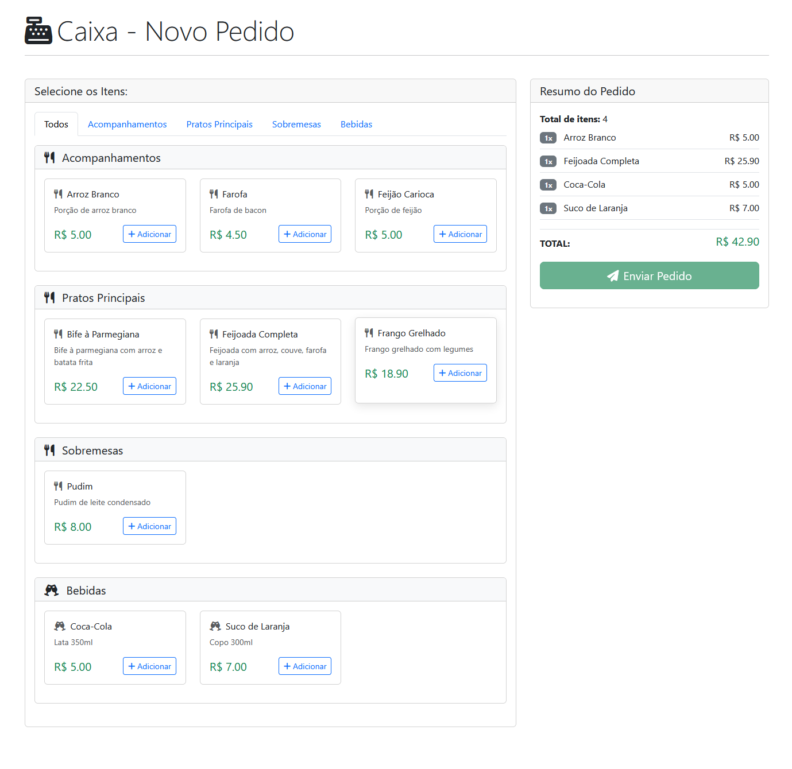
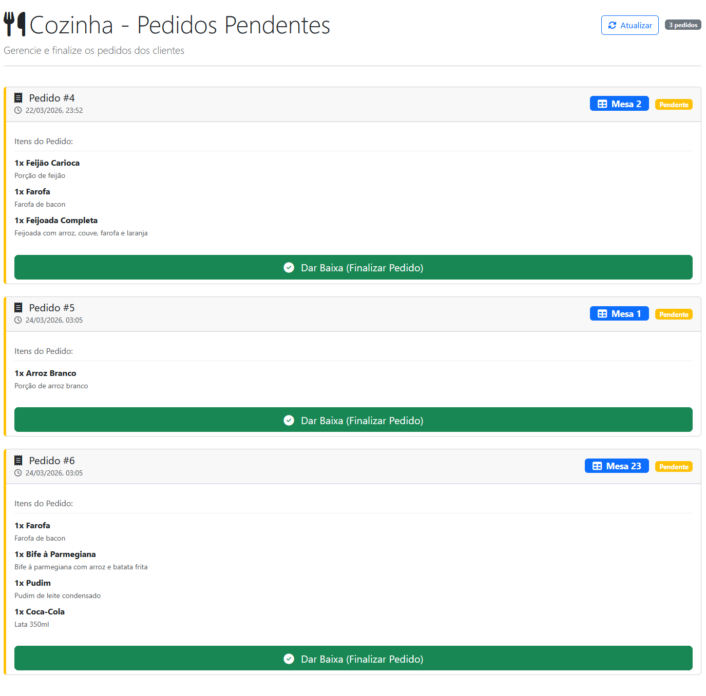

# Welcome to GastroFlow 👋
> A complete web application for restaurants to register and take orders for customers, built with PHP, JavaScript, and Docker...



## Author
👤 **Henry Sampaio**

* Website: https://focuseven.netlify.app
* Github: [@FocusEvenGitHub](https://github.com/FocusEvenGitHub)
* LinkedIn: [@Henry Sampaio](https://linkedin.com/in/Henry-Sampaio)

## Show your support

Give a ⭐️ if this project helped you!

***

## 🧠 About

**GastroFlow** is a restaurant management platform that allows:

- 📋 Each restaurant to register its account
- 🍽️ To receive online customer orders
- 🛠️ To run in a Docker environment
- 🚀 To be easily customized and expanded

This README provides complete instructions for starting, developing, and contributing to the project.

---

## 🚀 Features

- 🧾 **Cashier** – interface for placing orders, selecting items, adding notes, and sending them to the kitchen.
- 👨‍🍳 **Kitchen** – real-time view of pending orders, with the option to finalize them.
- 🛠️ **Admin** – complete menu management: add, edit, and activate/deactivate items.
- 🔌 **RESTful API** – endpoints ready for integration with other systems.
- 🐳 **Docker Environment** – fast and standardized execution.

---

## 📦 Technologies Used

- 🐘 PHP (sem framework, com rotas via .htaccess)
- 🎨 Bootstrap 5 + Font Awesome
- ⚡ JavaScript puro (fetch API)
- 🐬 MySQL (com suporte a UTF-8)
- 🐳 Docker & Docker Compose

---

## 🧱 Project Structure

📦 GastroFlow\
├── app/\
├── Dockerfile\
├── docker-compose.yml\
├── .env.example\
└── (others) (files/patches)

---

## 🛠️ Prerequisites

Before starting, make sure you have installed:

- 🐳 **Docker**
- 📦 **Docker Compose**
- 🧠 Code editor (VS Code, PHPStorm, etc.)

---

## 🔧 Installation

1. Clone the repository:

```bash
git clone https://github.com/FocusEvenGitHub/GastroFlow.git
```
2. Access the folder:

```
cd GastroFlow
```
3. Copy .env.example to .env and fill in the environment variables:

```
cp .env.example .env
```
4. Start the containers:
```
docker compose up -d
``` 
5. Access in your browser:
```
http://localhost:8080
```
---
## 🧪 How to Use

After setting up the environment with Docker:

- Create a restaurant in the system
- Log in to the administrative interface
- Test the order flow as a customer
---
## 📍 Endpoints
Important endpoints here when the backend is documented
``` 
| Method | Endpoint                     | Description                         |
|--------|------------------------------|-------------------------------------|
| GET    | `/api/menu`                  | List all menu items                 |
| POST   | `/api/orders`                | Create a new order                  |
| GET    | `/api/orders?status=pending` | List orders by status               |
| POST   | `/api/orders/{id}/complete`  | Mark an order as completed          |
| POST   | `/api/items`                 | Add a new item to the menu          |
| PATCH  | `/api/items/{id}`            | Activate/deactivate a menu item     |
```
## 📍 Access
After starting the containers with Docker:

- Access the **cash register** at: [http://localhost:8080/cashier](http://localhost:8080/cashier)
- Access the **kitchen** at: [http://localhost:8080/kitchen](http://localhost:8080/kitchen)
- Access the **admin** at: [http://localhost:8080/admin](http://localhost:8080/admin) (menu management)

To create a new order, fill in the table number, select the items, and click "Submit Order".

In the kitchen, orders appear automatically and can be finalized.
In the admin, you can add new items, edit descriptions/prices, and enable/disable items.

---
## Folder Structure

Update with the actual project layout:
```
GastroFlow/
├── app/
│   ├── cashier/          
│   ├── kitchen/          
│   ├── admin/            
│   ├── api/              
│   │   ├── index.php
│   │   ├── menu.php
│   │   └── orders.php
│   └── common/           # db, helpers
│       └──assets/        # img
├── .htaccess             # routes rules
├── docker-compose.yml
├── Dockerfile
└── README.md
```

## 🧩 Contributing

If you want to contribute:

1. Fork the repository ✌️
2. Create a branch:
``` 
git checkout -b feature/feature-name
```
3. Commit your changes
``` 
git commit -m "feat: description"
``` 
4. Push to the repository:
``` 
git push origin feature/feature-name
```

5. Open a Pull Request 📨
---
### Contacts

If you want to discuss improvements or have technical questions, open an issue on GitHub or contact the maintainers.

Thank you for contributing to and using GastroFlow! ✨