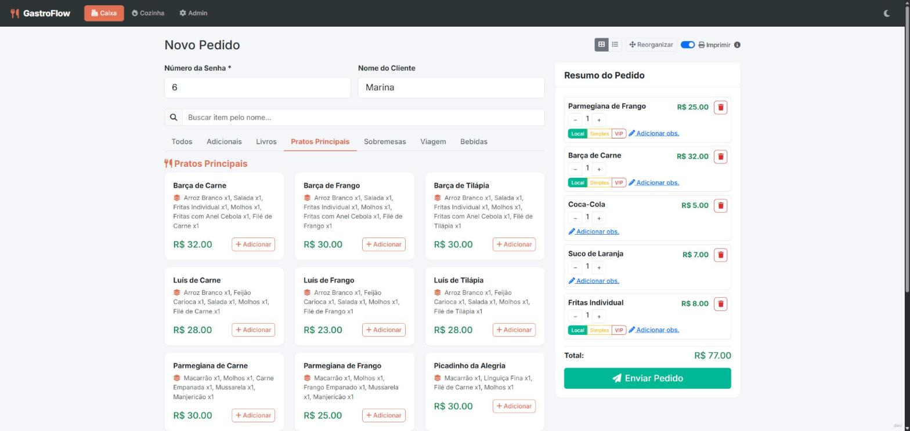
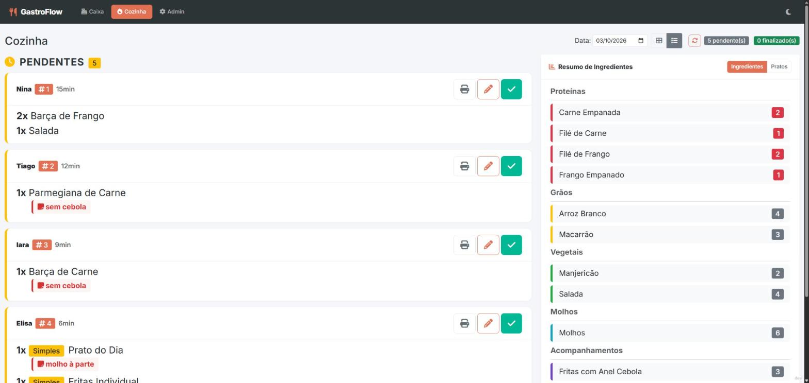
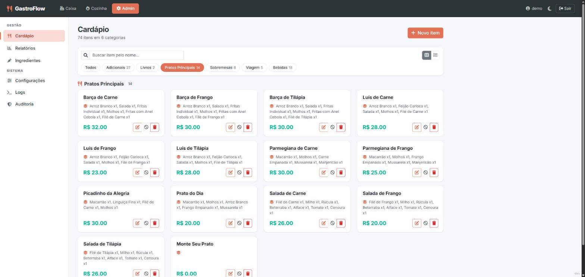
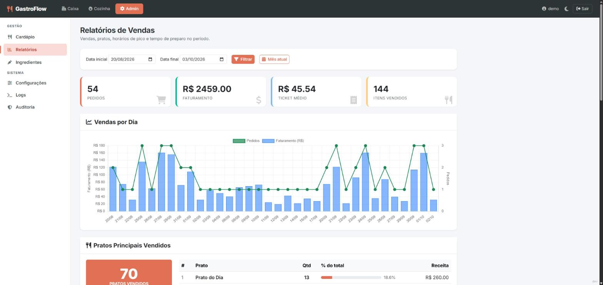
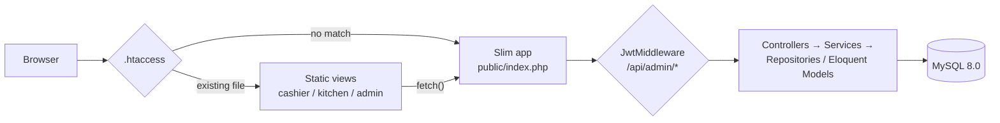

<p align="center">
  
</p>

<h1 align="center">GastroFlow</h1>

<p align="center">
  Restaurant order management system — cashier, kitchen, admin and reporting in one app.<br>
  PHP 8 (Slim 4 + Eloquent), Alpine.js, MySQL, Docker.
</p>

<p align="center">
  
  
  
  <a href="https://github.com/FocusEvenGitHub/GastroFlow/actions/workflows/ci.yml"></a>
</p>

---

## Screenshots

| Cashier | Kitchen |
|---|---|
|  |  |
| Pick items by category, choose dine-in or takeaway, send the order to the kitchen | Pending orders in real time, with the ingredient summary side panel |
| **Admin** | **Reports** |
|  |  |
| Menu management: search, filter by category, enable/disable items | Sales summary, sales per day, main dishes sold |

---

## Overview

GastroFlow is a restaurant order-management system: a cashier takes an order and issues a sequential pickup ticket number ("Senha"), the kitchen sees it appear in real time and marks it done, an admin panel manages the menu and produces a receipt on a thermal printer, and a reporting module turns the accumulated order history into sales, timing and demand insights. It targets a single-location restaurant running everything — cashier terminal, kitchen display, admin panel — on one local network, which is why the design favors a simple, self-hosted deployment over a distributed one.

It is also a working environment for practicing spec-driven development and AI-assisted coding under real constraints rather than in a toy repo — see [How this project is built](#how-this-project-is-built).

---

## Documentation

This README is the entry point. Depth lives alongside it, by topic:

| Doc | Covers |
|---|---|
| [`docs/architecture.md`](docs/architecture.md) | Request lifecycle, layer-by-layer breakdown, realtime events, jobs/printing, logging, audit history, known limitations |
| [`docs/technical-decisions.md`](docs/technical-decisions.md) | Every technical decision with its trade-offs, plus open ones |
| [`CHANGELOG.md`](CHANGELOG.md) | Everything that has shipped, release by release |
| [`docs/ROADMAP.md`](docs/ROADMAP.md) | Milestones: what's done, what's next, and the rules behind them |
| [`specs/`](specs/) · [`specs/README.md`](specs/README.md) | One file per change (problem, plan, implementation log, validation evidence) and the spec lifecycle |
| [`CLAUDE.md`](CLAUDE.md) | Rules for AI-assisted development, and the full list of commands that exist (migrations, worker, tests, static analysis…) |
| [`docs/COMMIT_CONVENTION.md`](docs/COMMIT_CONVENTION.md) | Commit types, scopes and emoji; release and changelog workflow |

---

## Architecture

Slim bootstraps in `public/index.php` → `App\App::get()` → `App\Routes::register()`. The detail that matters most: **not everything goes through Slim**. `public/.htaccess` serves any existing file or directory directly, so the cashier, kitchen and admin panels are plain Alpine.js views executed directly by Apache — only the `/api/*` routes, `/` and `/health/*` go through Slim (the SSE stream, `public/api/events/stream.php`, is itself a plain file).


```mermaid
flowchart LR
    Browser --> Htaccess{".htaccess"}
    Htaccess -->|"existing file"| Views["Static views<br/>cashier / kitchen / admin"]
    Htaccess -->|"no match"| Slim["Slim app<br/>public/index.php"]
    Views -->|"fetch()"| Slim
    Slim --> Auth{"JwtMiddleware<br/>/api/admin/*"}
    Auth --> Layers["Controllers → Services →<br/>Repositories / Eloquent Models"]
    Layers --> DB[("MySQL 8.0")]
```

- `src/` follows Controllers → Services → Repositories/Models, with `Validators/` for input shape.
- Kitchen live updates are Server-Sent Events fed by an `events` table in MySQL (`EventPublisher`), with `Last-Event-ID` reconnection.
- Printing (ESC/POS) runs through an async DB-backed job queue (`bin/worker`), so a print failure never fails the order.

Full breakdown, project-structure tree and known limitations: [`docs/architecture.md`](docs/architecture.md).

---

## Tech stack

| Technology | Role |
|---|---|
| PHP >= 8.1 (`php:8.2-apache` in Docker) | Backend language and runtime |
| Slim 4 + `php-di/slim-bridge` | Routing, PSR-15 middleware, DI container |
| Eloquent (`illuminate/database`, via `Capsule\Manager`) | ORM / query builder, without the rest of Laravel |
| `vlucas/valitron` | Input validation |
| `firebase/php-jwt` | JWT issuance/verification for the admin area |
| `monolog/monolog` | Application logging (`logs/app.log`, viewable from the admin panel) |
| `mike42/escpos-php` | ESC/POS thermal receipt printing over the network |
| MySQL 8.0 | Persistence |
| Alpine.js + Bootstrap 5 | Frontend reactivity and UI, no build step |
| Docker Compose | Local dev/runtime environment |

---

## Technical decisions

Five picks that best represent how this project trades things off — the full list with trade-offs is in [`docs/technical-decisions.md`](docs/technical-decisions.md):

- **Slim 4, not a full framework** — routing/middleware/DI without adopting everything Laravel brings, for a project that started as raw PHP.
- **Eloquent standalone** (`Capsule\Manager`), not full Laravel — a familiar query builder without the framework around it.
- **Hand-rolled SQL migrations**, not an ORM migration framework — explicit, diffable schema changes; the cost is no rollback semantics.
- **MySQL-backed realtime events**, not Redis/RabbitMQ — SSE reads an `events` table, so no extra infrastructure for a single-location deployment.
- **DB-backed job queue** (`bin/worker`), not a message broker — avoids adding infrastructure for one background job type (printing).

---

## How this project is built

- **Specs before non-trivial code.** Every change goes through a file under [`specs/`](specs/) with a defined lifecycle (`Draft → Approved → In Progress → Implemented → Verified`); `Verified` requires recorded evidence for each acceptance criterion. Lifecycle and skills: [`specs/README.md`](specs/README.md).
- **AI-assisted, human-directed.** Claude Code investigates, plans, implements and reviews; the human sets the goal and approves. [`CLAUDE.md`](CLAUDE.md) holds the hard rules (no secrets, no commits unless asked, no destructive DB operations, never claim a check passed without running it), and three checked-in skills — [`spec-plan`](.claude/skills/spec-plan/SKILL.md), [`spec-implement`](.claude/skills/spec-implement/SKILL.md), [`spec-review`](.claude/skills/spec-review/SKILL.md) — run the workflow.
- **CI on every push and PR** ([`ci.yml`](.github/workflows/ci.yml)): line-ending check, `composer validate`, `composer audit`, PHPStan, PHP-CS-Fixer, unit tests, integration tests against real MySQL, and Playwright browser tests.
- **Conventional commits and tagged releases** — [`docs/COMMIT_CONVENTION.md`](docs/COMMIT_CONVENTION.md); one changelog entry per spec.

---

## Roadmap

Current release: **`v1.8.3`**. Current milestone: **`v1.9.0` — Community Productization** (local frontend dependencies, LAN operation without internet, installation and upgrade experience, documentation, open-source readiness).

What shipped and when: [`CHANGELOG.md`](CHANGELOG.md). What's planned: [`docs/ROADMAP.md`](docs/ROADMAP.md).

---

## Learnings

What changed how I approach the work, not a technology list:

- **Early architecture doesn't have to be final, but rewrites are expensive.** The move from a raw-PHP prototype to Slim 4 + Eloquent (`0.0.2`, May 2026) happened once the original structure stopped scaling, five months after the first commit — worth doing deliberately, once.
- **Documenting gaps is more valuable than hiding them.** `specs/000-project-baseline.md` records exactly what's confirmed, partially implemented, or simply not found — that accurate ground truth is what the spec workflow was then built on top of.
- **AI assistance needs explicit boundaries to stay useful.** Left unconstrained, it tends to "complete the pattern" — adding a Repository or Validator for symmetry where the codebase never had one. `CLAUDE.md` exists to write that boundary down.
- **A spec that requires evidence catches overclaiming before it ships.** `Verified` only applies once acceptance criteria have recorded evidence, which forces "did I actually check this" to be answered in writing.

---

## Getting started

### Prerequisites

- Docker (v20.10+) and Docker Compose (v2.0+)

### Installation

```bash
git clone https://github.com/FocusEvenGitHub/GastroFlow.git
cd GastroFlow

cp .env.example .env
# Generate a JWT secret and set it as JWT_SECRET in .env:
openssl rand -base64 48

docker compose up -d

# Create your administrator account (no default credentials are seeded):
docker compose exec web php bin/create-admin admin

# Optional (fresh install, or APP_ENV=development): fictional orders — last 45 days + 5 pending today
docker compose exec web php bin/seed-demo
```

- Application: [http://localhost:8080](http://localhost:8080)
- Interactive API docs: [http://localhost:8080/api/docs](http://localhost:8080/api/docs)

Composer runs inside the container (`docker compose exec web composer install`). Every other command (migrations, print worker, job/event pruning, tests, static analysis) is listed in [`CLAUDE.md`](CLAUDE.md) › "Commands actually available".

### Backup & restore

```bash
./bin/backup-db                                                  # → backups/gastroflow-<db>-<timestamp>.sql.gz
./bin/restore-db                                                 # most recent backup
./bin/restore-db gastroflow-restaurant-20260901-030000.sql.gz    # a specific one
```

Both run on the **host** and use the `db` container's own `mysqldump`/`mysql` — nothing to install. `bin/restore-db` drops and recreates every table, so it asks you to type `RESTAURAR` (or pass `--yes`). Backups land in `backups/` (gitignored).

### Line endings (Windows)

`.gitattributes` is the single source of truth for line endings — every tracked text path has an explicit `eol=lf` rule (spec 049). On Windows, also set:

```bash
git config core.autocrlf false
```

Git for Windows defaults `core.autocrlf` to `true`, which can still leave CRLF files on disk. If your working tree was already affected (PHP-CS-Fixer flags whole files git calls unmodified), rebuild it from the index — with a clean `git status` first:

```bash
git rm --cached -r .
git reset --hard
```

---

## Using the app

- **Cashier** (`/cashier/`) — create an order under a pickup ticket number ("Senha"), select items, add notes, send to the kitchen.
- **Kitchen** (`/kitchen/`) — pending orders appear in real time; mark as done, reopen, edit, or reprint.
- **Admin** (`/admin/`) — menu, dish components, ingredients, settings, audit history and the app log. Log in with the account created by `bin/create-admin` (see [Installation](#installation)).
- **Reports** (`/admin/reports.php`) — sales summary, top items, dining-option split, peak hours, average prep time, month-over-month comparison.

---

## API

Full interactive documentation (all endpoints, request/response schemas, "Try it out", JWT auth via the **Authorize** button) is served at [http://localhost:8080/api/docs](http://localhost:8080/api/docs) once the containers are running.

<details>
<summary>cURL examples</summary>

```bash
# Full menu
curl -s http://localhost:8080/api/menu | python -m json.tool

# Create an order (the pickup number is assigned by the server)
curl -s -X POST http://localhost:8080/api/orders \
  -H "Content-Type: application/json" \
  -d '{"customer_name":"Ana","items":[{"id":1,"quantity":2,"notes":"no onion"}]}' | python -m json.tool

# Login (use the account you created with `bin/create-admin`)
curl -s -X POST http://localhost:8080/api/login \
  -H "Content-Type: application/json" \
  -d '{"username":"admin","password":"your-password-here"}' | python -m json.tool

# Use the token against admin routes
TOKEN="paste-your-token-here"
curl -s -H "Authorization: Bearer $TOKEN" http://localhost:8080/api/admin/menu | python -m json.tool
```

</details>

---

## Contributing

1. Fork the repository
2. Create a branch (this repo uses one branch per spec, named after its number — e.g. `054`; outside contributors can use `feature/feature-name`)
3. Commit following [`docs/COMMIT_CONVENTION.md`](docs/COMMIT_CONVENTION.md)
4. Push and open a Pull Request

Bugs, questions and improvement ideas: [open an issue](https://github.com/FocusEvenGitHub/GastroFlow/issues).

---

## Author

**Henry Sampaio**

- Website: [https://focuseven.netlify.app](https://focuseven.netlify.app)
- GitHub: [@FocusEvenGitHub](https://github.com/FocusEvenGitHub)
- LinkedIn: [Henry Sampaio](https://linkedin.com/in/Henry-Sampaio)
