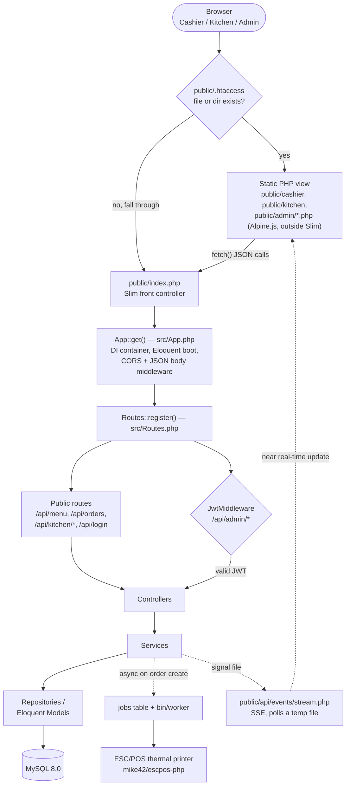

# Architecture

Deep dive into how GastroFlow is actually built — not an idealized version. See the [README](../README.md) for the short version, and [`specs/000-project-baseline.md`](../specs/000-project-baseline.md) for the code-verified snapshot this document is derived from.

## Request lifecycle

Slim bootstraps in `public/index.php` → `App\App::get()` (`src/App.php`) → `App\Routes::register()` (`src/Routes.php`). The detail that matters most: **not everything goes through Slim**. `public/.htaccess` serves any existing file or directory directly, so `public/cashier/`, `public/kitchen/`, and `public/admin/*.php` are plain PHP/Alpine.js view scripts executed directly by Apache. Only `/api/*` and the `/` redirect are actual Slim routes.



Two things worth stating explicitly:

- **Only `/api/admin/*` requires a JWT.** `/api/orders*`, `/api/menu`, `/api/kitchen/*` are intentionally unauthenticated — a deliberate choice for a single-location, trusted-network deployment, not an oversight.
- **`public/.htaccess` bypassing Slim is deliberate**, not incidental: the three panels are static Alpine.js shells that only call the JSON API, so there's no reason to pay routing/middleware overhead for them. The cost is that two separate request-handling paths exist, and anything needing CORS/auth middleware has to live under `/api/*`.

## Layers under `src/`

Coverage is real but uneven — this reflects what's actually implemented, not a target architecture:

| Layer | What exists | Gap |
|---|---|---|
| `Controllers/` | 8: Admin, Auth, Dish, Ingredient, Kitchen, Menu, Order, Report | — |
| `Services/` | 6: Job, Kitchen, Menu, Order, Print, Report | — |
| `Repositories/` | 2: Menu, Order | `Dish`/`Ingredient` controllers call Eloquent models directly — no repository layer for them |
| `Validators/` | 1: `OrderValidator` (wraps `vlucas/valitron`) | No validator for menu items, ingredients, or settings |
| `Middleware/` | 3 (PSR-15): Cors, JsonBodyParser, Jwt | `Jwt` applies only to the `/api/admin` route group |
| `Models/` | 8 Eloquent models: User, Category, MenuItem, Ingredient, Order, OrderItem, Setting, Job | — |

Extending `Repositories/`/`Validators/` to cover the remaining domains is tracked in `docs/ROADMAP.md`'s `v1.7.0 — Domain & Architecture` phase ("Controller responsibilities", "Persistence boundaries"), not assumed to already be done.

## Real-time kitchen updates (SSE)

The kitchen's "real-time" update is a signal file, not a message queue: `OrderService` writes a JSON file to `sys_get_temp_dir()` on order creation/completion, and `public/api/events/stream.php` polls it to emit Server-Sent Events. This works correctly for a single app instance and zero extra infrastructure, but is not safe under concurrent writes or a multi-instance deployment — `docs/ROADMAP.md`'s `v1.8.0 — Reliability & Quality` phase ("Realtime reliability") plans to replace it with Redis pub/sub or a MySQL-backed `events` table.

## Background jobs and printing

`PrintService` builds an ESC/POS receipt (header, items, packaging labels, total, footer) via `mike42/escpos-php` over `NetworkPrintConnector`. Printing is dispatched asynchronously: `src/Jobs/PrintOrderJob.php` + `src/Services/JobService.php` write to a DB-backed `jobs` table (migration `common/migrations/007_jobs.sql`), processed by the long-running `bin/worker` CLI script — not started by `docker compose up -d` alone, it must be supervised separately. Print failures are logged via Monolog but intentionally never thrown: a receipt failing to print should not fail the order.

## Persistence

Eloquent (`illuminate/database ^10`) via `Illuminate\Database\Capsule\Manager`, booted in `src/Database.php`. Initial schema: `common/sql/001_schema.sql`, mounted into the `db` container's `docker-entrypoint-initdb.d` (only runs on first volume init). Incremental changes: 8 files under `common/migrations/*.sql`, applied by the custom `App\Database\MigrationRunner` through `bin/migrate`, which tracks applied files in a `migrations` table. There is no ORM-style migration framework — migrations are forward-only, with no `down()`/rollback semantics.

`common/config.php` and `common/db.php` are legacy raw-PDO helpers with no callers found anywhere in `src/` or `public/` — dead code, not yet removed (open question in `specs/000-project-baseline.md`: whether something external still depends on them).

## Project structure

```
GastroFlow
├── public/                  # DocumentRoot. Slim entry point AND static view scripts.
│   ├── index.php            # Slim front controller — only path that goes through App::get()
│   ├── .htaccess             # Routes existing files/dirs directly, everything else to index.php
│   ├── cashier/, kitchen/, admin/   # Alpine.js views, executed as plain PHP outside Slim
│   ├── api/docs/             # Static OpenAPI viewer (openapi.yaml)
│   ├── api/events/stream.php # SSE endpoint, plain PHP script, also outside Slim
│   └── assets/               # CSS, JS, images
├── src/                      # PSR-4 application code (App\)
│   ├── Controllers/, Services/, Repositories/, Validators/, Middleware/, Models/   # see table above
│   ├── Jobs/                   # PrintOrderJob — processed by bin/worker
│   └── App.php, Routes.php, Settings.php, Database.php, Database/MigrationRunner.php
├── common/
│   ├── sql/001_schema.sql     # Initial schema — mounted into MySQL's first-init only
│   ├── migrations/*.sql       # Incremental migrations, applied via bin/migrate
│   └── config.php, db.php     # Legacy raw-PDO helpers with no callers — dead code
├── bin/                        # migrate, worker — CLI entry points
├── legacy/                     # Empty, tracked — kept as a marker, not in active use
├── specs/                       # Spec-driven development: baseline, template, and one file per change
├── docs/                         # This directory
├── .claude/skills/               # /spec-plan and /spec-implement skill definitions
├── CLAUDE.md, ROADMAP.md, CHANGELOG.md, COMMIT_CONVENTION.md
├── Dockerfile                    # php:8.2-apache
└── docker-compose.yml             # db (MySQL 8.0) + web (container: restaurant_web)
```

## Known architectural limitations

Named, not hidden — tracked in `specs/000-project-baseline.md` and `docs/ROADMAP.md`:

- CORS defaults to `*` when `CORS_ALLOWED_ORIGIN` is unset; configurable per spec 001, but the permissive default is still an open gap (`docs/ROADMAP.md`'s `v1.6.0 — Baseline & Security` phase doesn't yet name a fix for the default itself).
- No lint/static-analysis tooling (`docs/ROADMAP.md`'s `v1.8.0 — Reliability & Quality` phase: "Static analysis", "Code style"). The hardcoded JWT-secret fallback and the lack of a test suite/CI pipeline, both previously listed here, were fixed by specs 002, 004 and 005 (`v1.5.6`).
- `IngredientController` exists but no `/api/admin/ingredients*` route was found wired in `src/Routes.php` — not confirmed whether it's reachable another way.
- Migrations are forward-only; no rollback mechanism.
- Signal-file SSE and the DB-backed job queue both assume a single app instance.
