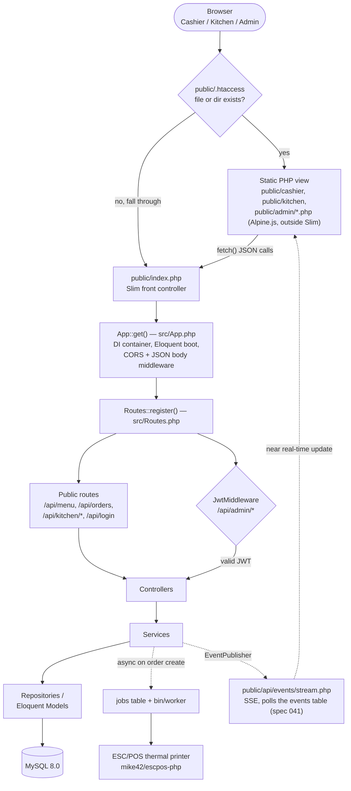
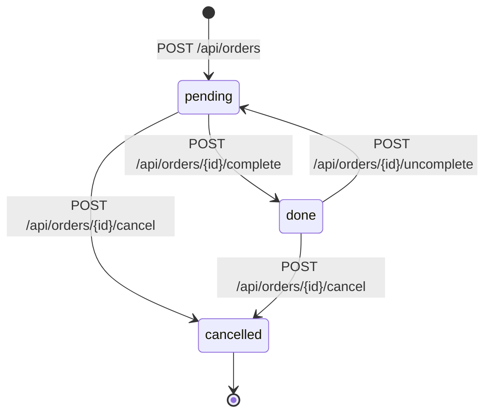

# Architecture

Deep dive into how GastroFlow is actually built — not an idealized version. See the [README](../README.md) for the short version, and [`specs/000-project-baseline.md`](../specs/000-project-baseline.md) for the code-verified snapshot this document is derived from.

## Request lifecycle

Slim bootstraps in `public/index.php` → `App\App::get()` (`src/App.php`) → `App\Routes::register()` (`src/Routes.php`). The detail that matters most: **not everything goes through Slim**. `public/.htaccess` serves any existing file or directory directly, so `public/cashier/`, `public/kitchen/`, and `public/admin/*.php` are plain PHP/Alpine.js view scripts executed directly by Apache. Only `/api/*` and the `/` redirect are actual Slim routes.



Two things worth stating explicitly:

- **Only `/api/admin/*` requires a JWT.** `/api/orders*`, `/api/menu`, `/api/kitchen/*` are intentionally unauthenticated — a deliberate choice for a single-location, trusted-network deployment, not an oversight.
- **`public/.htaccess` bypassing Slim is deliberate**, not incidental: the three panels are static Alpine.js shells that only call the JSON API, so there's no reason to pay routing/middleware overhead for them. The cost is that two separate request-handling paths exist, and anything needing CORS/auth middleware has to live under `/api/*`.

## Authentication

The full lifecycle, documented in one place (`docs/ROADMAP.md`'s `v1.6.0 — Baseline & Security` phase, "Authentication hardening"):

- **Issuance**: `POST /api/login` (`AuthController::login`) looks up the user by username, verifies the password with `password_verify()`, and issues an HS256 JWT via `firebase/php-jwt` containing `sub`/`username`/`role`, valid for 8 hours (`'exp' => time() + 3600 * 8`).
- **Verification**: `JwtMiddleware`, applied to the `/api/admin` route group (plus the standalone `PATCH /api/admin/account/password` route — see below), distinguishes three outcomes: no `Authorization: Bearer ...` header → `401` `"Token não fornecido."`; a syntactically valid but expired token → `401` `"Token expirado."`; anything else that fails to decode (bad signature, malformed, wrong algorithm) → `401` `"Token inválido."`. On success, the decoded payload is attached to the request as the `user` attribute for downstream handlers.
- **Password hashing**: `password_hash($password, PASSWORD_BCRYPT)` everywhere a password is stored (`bin/create-admin`, `AuthController::changePassword`), verified with `password_verify()`. No custom hashing scheme.
- **Password changes**: `PATCH /api/admin/account/password` (JWT-protected), added to close the "password changes" item in the roadmap's authentication checklist. Requires the correct `current_password` before accepting a `new_password` (minimum 8 characters) — this stops a leaked/stolen JWT alone from letting an attacker lock out the legitimate user, since there is no server-side session to separately invalidate. Changing a password does **not** invalidate the JWT used to make the request, or any other JWT already issued to that user — it remains valid until its own 8-hour expiry. This is a deliberate limitation, not an oversight: revoking it would require a server-side token-revocation mechanism (see next point).
- **Logout**: there is no `POST /api/logout` route and no server-side token-revocation mechanism of any kind. JWTs are stateless and self-contained — nothing in `Middleware/` queries a database or cache to validate a token beyond its signature and expiry. "Logging out" today means the client discards its own token; the worst case of a leaked token is bounded by its 8-hour expiry. This is a deliberate choice matching the project's "Keep the stack proportional" principle (`docs/ROADMAP.md`) — a revocation list would need a shared store (Redis, a DB table) for a single-location deployment that doesn't otherwise need one. If this stops being acceptable (e.g., multi-location deployments, longer token lifetimes), it would need its own dedicated design, not a small addition here.
- **Login throttling**: **not implemented.** `POST /api/login` has no rate limiting, failed-attempt counting, or lockout today. This is a known, tracked gap (`docs/ROADMAP.md`'s "Authentication hardening" item lists it explicitly) — deliberately deferred to its own follow-up spec rather than bundled into the work above, since it needs its own design decisions (per-IP vs per-username tracking, storage mechanism — this project has no Redis/cache, so it likely needs a small schema addition — and lockout duration).

## Order lifecycle

`orders.status` (`common/sql/001_schema.sql`, migrated by `common/migrations/013_order_cancellation.sql`) is a 3-value enum, each reachable through an actual code path — the schema previously also had unused `preparing`/`ready` values (spec 020 removed them, per `docs/ROADMAP.md`'s "Order lifecycle" item: don't keep statuses "merely for theoretical completeness").



- **`cancelled` is terminal.** No route transitions an order out of it — `OrderRepository::completeOrder()`/`::uncompleteOrder()`/`::cancelOrder()` each check the current status first and throw `\DomainException` (→ `409`) if it's already `cancelled`. This is a deliberate design choice (nothing in this project's real workflow needs "un-cancel"), not a roadmap requirement — see `specs/020-order-lifecycle.md`'s Non-goals.
- **Cancellation preserves the row.** `POST /api/orders/{id}/cancel` replaced the old `DELETE /api/orders/{id}` (hard delete, no trace left) — a cancelled order stays in `orders`, just excluded from the kitchen's `pending`/`done` views and from `ReportService`'s revenue queries (both already filtered by exact status value, unaffected by adding a third one).
- **`preparing`/`ready` were never implemented** as a real kitchen workflow (no UI, no code path) — removed from the schema rather than kept as dead options. Reintroducing a multi-stage kitchen flow would be new scope, not a gap in what's documented here.

## Layers under `src/`

Coverage is real but uneven — this reflects what's actually implemented, not a target architecture:

| Layer | What exists | Gap |
|---|---|---|
| `Controllers/` | 10: Auth, Dish, Ingredient, Kitchen, Log, Menu, Order, Printer, Report, Settings | `Dish` has **no route registered anywhere** in `src/Routes.php` — entirely unreachable dead code (confirmed by grep, spec 027). `Ingredient` was the same until spec 027 wired `/api/admin/ingredients*` up. `AdminController` (formerly Settings+Printer+Log combined) was split into `Settings`/`Printer`/`Log` controllers in spec 028, per the roadmap's own worked example |
| `Services/` | 8: Ingredient, Job, Kitchen, Menu, Order, Pricing, Print, Report | `PricingService` (spec 026) centralizes pricing policy previously embedded in `OrderRepository`/`PrintService`; `IngredientService` (spec 029) is a thin pass-through to `IngredientRepository`, mirroring `MenuService` |
| `Repositories/` | 3: Ingredient, Menu, Order | `Dish` controller still calls the Eloquent model directly — moot while unreachable (dead code, not fixed by spec 029, which only covers reachable `Ingredient`) |
| `Validators/` | 5: `OrderValidator`, `MenuItemValidator`, `IngredientValidator`, `SettingsValidator`, `AuthValidator` (all wrap `vlucas/valitron`) — spec 027 | — |
| `Middleware/` | 4 (PSR-15): Cors, JsonBodyParser, Jwt, Role | `Jwt`/`Role` apply only to the `/api/admin` route group |
| `Models/` | 9 Eloquent models: User, Category, MenuItem, Ingredient, Order, OrderItem, OrderNumberCounter, Setting, Job | — |

Every subsection `docs/ROADMAP.md`'s `v1.7.0 — Domain & Architecture` phase names has a corresponding `Verified` spec as of spec 029 (specs 019–029) — whether that satisfies the phase's own Exit Gate is `docs/ROADMAP.md`'s determination to make, not asserted here. `Dish` remains dead code, untouched by any of these (no route references it — reintroducing it, if ever wanted, is new scope).

## Real-time kitchen updates (SSE)

**Rebuilt on a MySQL-backed `EventPublisher` (spec 041).** `OrderService` depends only on the
`App\Services\EventPublisher` interface — never on how an event actually reaches the kitchen —
and publishes through `DatabaseEventPublisher`, which inserts a row into the `events` table
(migration `017_realtime_events.sql`). `public/api/events/stream.php` polls that table
(`WHERE id > :lastId`) and emits each row as an SSE frame with a real `id:` line, so the
browser's native `EventSource` reconnection (`Last-Event-ID`) works without any client code.

This replaces an earlier signal-file mechanism (`OrderService` writing a JSON file to
`sys_get_temp_dir()`) that was confirmed broken across containers: the print worker and the web
container never shared a filesystem, so an event from one was invisible to the other — found
while investigating specs 038-040, and fixed here rather than worked around again. `events` rows
are pruned after `EVENTS_RETENTION_DAYS` (default 2 — these rows exist for reconnect catch-up,
not as an audit trail) by the same hourly hook `bin/worker` already runs for the job queue
(spec 033), or on demand via `bin/events-prune`.

## Background jobs and printing

`PrintService` builds an ESC/POS receipt (header, items, packaging labels, total, footer) via `mike42/escpos-php` over `NetworkPrintConnector`. Printing is dispatched asynchronously: `src/Jobs/PrintOrderJob.php` + `src/Services/JobService.php` write to a DB-backed `jobs` table (migrations `common/migrations/007_jobs.sql` and `016_job_reliability.sql`), processed by the long-running `bin/worker` CLI script, which runs as the `print-worker` service in `docker-compose.yml` (added by spec 008). A print failure propagates out of `PrintService` so the queue can retry it, but never fails the order itself — order creation and printing are decoupled.

**Job state machine** (spec 033). `jobs.status` is the explicit state; every value is reachable by a real code path:

```text
pending ──claim──> reserved ──success──> completed ──prune (7d)──> deleted
   ^                   │
   │                   ├──throw, attempts < max──> pending (backoff 2^attempts)
   │                   ├──throw, attempts = max──> failed
   └──reservation expired, attempts left──┘
                       └──reservation expired, no attempts left──> failed
```

Claiming is atomic (`DB::transaction` + `lockForUpdate()`), and a claim stamps `reserved_until = now + QUEUE_RESERVATION_TIMEOUT` (default 300s). `reclaimStaleReservations()` recovers jobs whose `reserved_until` has passed — this is what stops a worker that dies mid-job from leaving a row claimed forever. The attempt consumed at claim time is never refunded, so a job that reliably kills its worker exhausts `max_attempts` instead of looping. The sweep runs at most once every 10s per process rather than on every claim (spec 037): its two unbounded `UPDATE`s over the same index ranges concurrent claims lock were **measured** to be what produced MySQL deadlocks under contention.

**`processNext()` runs in two phases** (spec 037), and the split is the point. Phase 1 runs the handler; a failure there is the job's failure and takes the retry/backoff path. Phase 2 records the result and **can never return the job to `pending`** — before this, a deadlock on the completion `UPDATE` (i.e. *after* the handler had already done its work) was caught by the same `catch` and re-queued the job, so the work was done twice. If the result cannot be recorded even after deadlock-aware retries, the job is parked in `failed` with a `last_error` saying the handler already ran. The queue therefore guarantees **at-most-once dispatch**, not exactly-once printing.

Successful jobs are kept as history (`completed_at`) and pruned after `QUEUE_RETENTION_DAYS` (default 7) by the worker hourly or by `bin/jobs-prune`. Failed jobs are never pruned automatically — they carry `last_error` and `failed_at` as the diagnostic record, and `bin/jobs-status [queue]` lists them alongside any expired reservations. Job failures are logged through Monolog to `logs/app.log`, so they appear in the Admin log viewer.

**Printer failure handling** (specs 038, 039). An unconfigured `printer_ip` makes `printOrder()` throw, like `printTestPage()` already did — it used to return silently, which marked the job `completed` and recorded an order as printed when nothing was. `POST /api/admin/settings/test-print` answers a printing failure with `503 PRINTER_UNAVAILABLE` and a message built from known facts (the configured address, or "IP not configured"), never echoed from the exception, which can carry vendor paths.

Three **permanently failed** print jobs in a row block printing globally. The counter lives in `settings` rather than being derived from the `jobs` table, because `bin/jobs-prune` deletes completed rows and keeps failed ones — after retention, a real `fail, fail, success, fail` sequence would read as three consecutive failures that never happened. Blocking is enforced **server-side** in `OrderService` (`createOrder()` and `printOrder()` skip the dispatch), not only in the UI, so an API client cannot keep piling up doomed jobs. **The order is still created and still returns `201`**: the roadmap's rule that a printer failure must never invalidate an order takes precedence over the block. Reactivation is manual, through `POST /api/printer/reset`, and touches no job.

The kitchen and cashier screens poll `GET /api/printer/status` every 15s, rather than using the SSE stream below, because this predates it (spec 039) and nothing has since needed to unify the two. **Corrected 2026-09-25 (spec 042): this paragraph used to justify the choice by the SSE mechanism being a per-container temp file, which stopped being true when spec 041 moved it to the `events` table** — that specific cross-container argument no longer applies, but polling here was never revisited since, so it remains a separate endpoint. The `jobs` table is the only state both screens and the worker share for printer failures. Both endpoints are public for the same reason `/api/orders*` is (spec 018): neither screen has a login.

## Logging and request tracing

**`request_id`/`user_id` correlation, and a traceable HTTP → Order → Job → Printing chain
(spec 042).** `App\Middleware\CorrelationIdMiddleware`, added globally in `src/App.php`, runs
first: it accepts an incoming `X-Request-Id` header when it matches `^[A-Za-z0-9._-]{1,64}$`
(rejecting anything else, since a header is attacker-controlled input a log line shouldn't
trust verbatim), or generates a 32-character hex id otherwise, stores it on
`App\Logging\RequestContext`, and echoes it back on the response header. `App\Logging\RequestIdProcessor`,
attached to the DI-bound `LoggerInterface`, then stamps `request_id` (and `user_id`, once
`JwtMiddleware` decodes a token) onto **every** log record for that request automatically — no
call site needs to pass them explicitly, including the global error handler.

That mechanism only reaches the synchronous HTTP path. Printing happens later, in a genuinely
separate OS process (`bin/worker`, no DI container, no shared `RequestContext`), so `request_id`
instead rides inside the job's own `payload` JSON: `JobService::dispatch()` stamps it onto the
job's `data` when a `RequestContext` with one is available, and `PrintOrderJob` reads it back out
to build the context `PrintService` logs with. This is the same technique the `events` table uses
to cross the container boundary (spec 041) — the shared MySQL row, not the process, is what
survives. `PrintService` and `JobService`'s own failure logging carry `order_id`/`job_id`/`event`
as structured Monolog context rather than string-concatenated messages, so an operator can follow
one `request_id` from the HTTP summary line through to the print attempt in one `app.log`.

**A PHP-DI pitfall worth knowing if this pattern is reused**: autowiring never resolves a
constructor parameter that already has a default value — regardless of its type hint or
nullability — it just uses the default. `JobService`'s `?RequestContext $requestContext = null`
(kept optional so `new JobService()` still works in `bin/worker`) would otherwise have silently
stayed `null` even when resolved through the container in the HTTP path; `src/App.php` overrides
just that one parameter with `\DI\autowire(JobService::class)->constructorParameter('requestContext',
\DI\get(RequestContext::class))`, verified empirically before relying on it.

## Audit history

**Business-level trail of sensitive administrative actions, deliberately separate from
`app.log` (spec 043).** The roadmap asks for the two to stay conceptually distinct, so this is
its own table (`audit_log`, migration `018_audit_log.sql`), append-only and never pruned —
unlike `jobs`/`events`, whose whole point is short-lived operational state, an audit trail's
whole point is to persist. `App\Services\AuditLogger` (a plain concrete class — nothing here
needs more than one implementation, unlike `EventPublisher`) reuses the same `RequestContext`
spec 042 built for request correlation to identify the actor (`user_id`/`username`, snapshotted
at write time so a later username change never rewrites history), rather than re-deriving it
from `$request->getAttribute('user')` at each call site.

Four call sites, deliberately not uniform in which layer they live in — each matches the real
layering of its own domain rather than forcing one rule: `MenuService::updateItem()` (the
Service layer that domain already has), `SettingsController::updateSettings()` and
`OrderController::uncomplete()` (Controllers directly — `SettingsController` has no Service
layer at all, and inventing one just for this would violate `CLAUDE.md`'s own rule against
layering for symmetry), and `bin/create-admin` (the only way to create a user — there is no
HTTP endpoint for it — with a never-populated `RequestContext` correctly producing a `null`
actor, not a fake one, since no authenticated actor exists in a CLI process).

Two of the roadmap's five named examples turned out to be one endpoint: "changed restaurant
settings" and "changed printer configuration" both go through the same
`PUT /api/admin/settings`, since `printer_ip`/`printer_port` are just two more keys in the
generic `settings` table (confirmed via `PrintService::getPrinterConfig()`) — there was never a
separate printer-configuration endpoint to instrument.

Read path mirrors `LogController`/`logs.php` (spec 033) exactly: `GET /api/admin/audit-log`
(admin-only, stricter than `manager` — matching that same existing bar, not a new one) and
`public/admin/audit-log.php`.

## Persistence

Eloquent (`illuminate/database ^10`) via `Illuminate\Database\Capsule\Manager`, booted in `src/Database.php`. Initial schema: `common/sql/001_schema.sql`, mounted into the `db` container's `docker-entrypoint-initdb.d` (only runs on first volume init). Incremental changes: 13 files under `common/migrations/*.sql` (currently up to `014_order_item_name_snapshot.sql`), applied by the custom `App\Database\MigrationRunner` through `bin/migrate`, which tracks applied files in a `migrations` table. There is no ORM-style migration framework — migrations are forward-only, with no `down()`/rollback semantics.

`common/config.php` and `common/db.php` are legacy raw-PDO helpers with no callers found anywhere in `src/` or `public/` — dead code, not yet removed (open question in `specs/000-project-baseline.md`: whether something external still depends on them).

## Project structure

```
GastroFlow
├── public/                  # DocumentRoot. Slim entry point AND static view scripts.
│   ├── index.php            # Slim front controller — only path that goes through App::get()
│   ├── .htaccess             # Routes existing files/dirs directly, everything else to index.php
│   ├── cashier/, kitchen/, admin/   # Alpine.js views, executed as plain PHP outside Slim
│   ├── api/docs/             # Static OpenAPI viewer (openapi.yaml)
│   ├── api/events/stream.php # SSE endpoint, plain PHP script, also outside Slim
│   └── assets/               # CSS, JS, images
├── src/                      # PSR-4 application code (App\)
│   ├── Controllers/, Services/, Repositories/, Validators/, Middleware/, Models/   # see table above
│   ├── Jobs/                   # PrintOrderJob — processed by bin/worker
│   └── App.php, Routes.php, Settings.php, Database.php, Database/MigrationRunner.php
├── common/
│   ├── sql/001_schema.sql     # Initial schema — mounted into MySQL's first-init only
│   ├── migrations/*.sql       # Incremental migrations, applied via bin/migrate
│   └── config.php, db.php     # Legacy raw-PDO helpers with no callers — dead code
├── bin/                        # migrate, worker — CLI entry points
├── legacy/                     # Empty, tracked — kept as a marker, not in active use
├── specs/                       # Spec-driven development: baseline, template, and one file per change
├── docs/                         # This directory
├── .claude/skills/               # /spec-plan and /spec-implement skill definitions
├── CLAUDE.md, ROADMAP.md, CHANGELOG.md, COMMIT_CONVENTION.md
├── Dockerfile                    # php:8.2-apache
└── docker-compose.yml             # db (MySQL 8.0) + web (container: restaurant_web)
```

## Known architectural limitations

Named, not hidden — tracked in `specs/000-project-baseline.md` and `docs/ROADMAP.md`:

- CORS defaults to `*` when `CORS_ALLOWED_ORIGIN` is unset; configurable per spec 001, but the permissive default is still an open gap (`docs/ROADMAP.md`'s `v1.6.0 — Baseline & Security` phase doesn't yet name a fix for the default itself).
- ~~No lint/static-analysis tooling~~ — closed by spec 034: PHPStan level 5 (`phpstan.neon`, findings frozen in `phpstan-baseline.neon`) and PHP-CS-Fixer (PSR-12, `.php-cs-fixer.dist.php`), both gating CI. The hardcoded JWT-secret fallback and the lack of a test suite/CI pipeline, also previously listed here, were fixed by specs 002, 004 and 005 (`v1.5.6`).
- Concurrency between two workers is exercised by `tests/Integration/ConcurrencyTest.php` against real MySQL (spec 035), but the race is **not deterministic** — a green run proves it did not happen that time, not that it cannot.
- The frontend's automated coverage is **deliberately narrow** (spec 040): `tests/e2e/` holds a five-test Playwright suite covering only what breaks exclusively in a browser — the Alpine/Bootstrap interaction that produced spec 039's invisible defect, enabled/disabled bindings, and elements that appear by condition. Layout and visual regression remain human checks. The suite runs against a **second app instance on port 8081** (`docker-compose.e2e.yml`) pointed at `restaurant_test`, so it never writes to the development database; the isolation works because `variables_order=EGPCS` populates `$_ENV` from the process environment and `public/index.php` uses immutable Dotenv, which does not overwrite it.
- Migrations are forward-only; no rollback mechanism.
- ~~Signal-file SSE~~ — replaced by a MySQL-backed `EventPublisher` (spec 041), which fixed the
  cross-container defect the file had; the realtime events table and the job queue both still
  assume Community's single-location model (`docs/ROADMAP.md`'s "Single-location first"), which
  is a deliberate scope boundary, not a gap.
